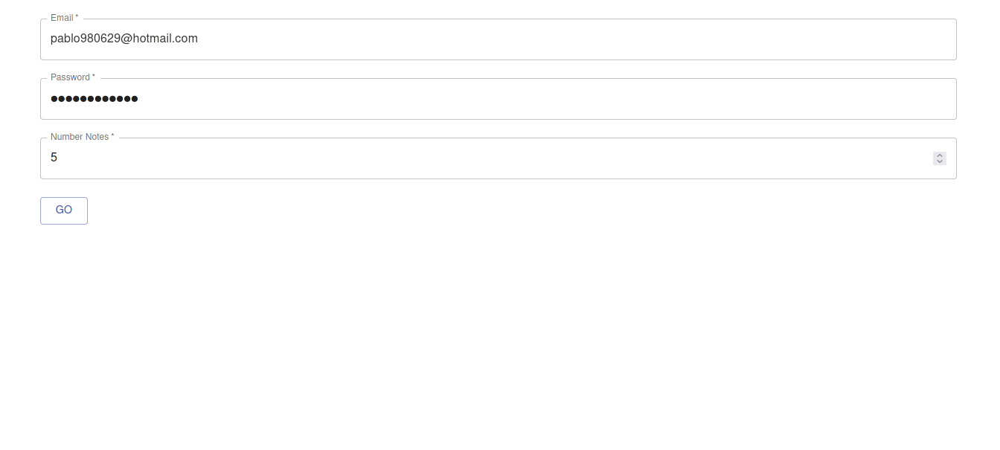
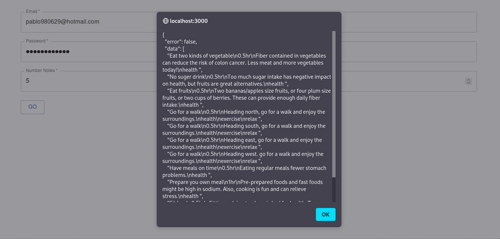
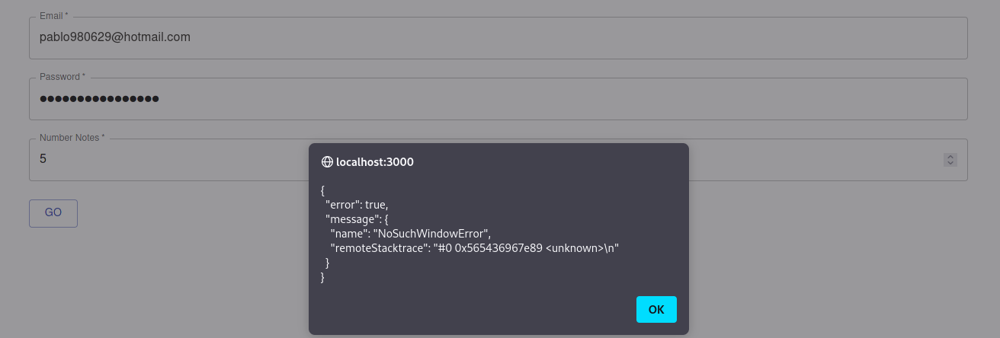

# TEST

For running the application you will need postgres sql to the db, in server/ormconfig.json you can modify the credential for the database access
also you will need npm and the driver for google chrome.

then you can execute the follow commands
```bash
cd server 
npm install
npm start dev
cd ..
cd web
npm install 
npm start
```

The react application allow to you to interact with the server, it will ask you for the credentials and the server will receive by params

if you dont want to use the React application to interact with the server you can reach the endpoint as follow

```bash
localhost:5000/api/v1/notes/getnotes?email=yourEmail&password=yourPassword
```
 
Also you can specify how many notes do you want (optional).
  
```bash
localhost:5000/api/v1/notes/getnotes?email=yourEmail&password=yourPassword&numberNotes=5
```

# Credentials



# Responses
# Ok

# Error


| Dependencies         | Where you can get it                        |
| -------------------- | ------------------------------------------- |
| nodejs               | https://nodejs.org/es/download/             |
| npm                  | https://www.npmjs.com/get-npm               |  
| postgres             | https://www.postgresql.org/download/        |
| Google Chrome Driver | https://chromedriver.chromium.org/downloads |
  
